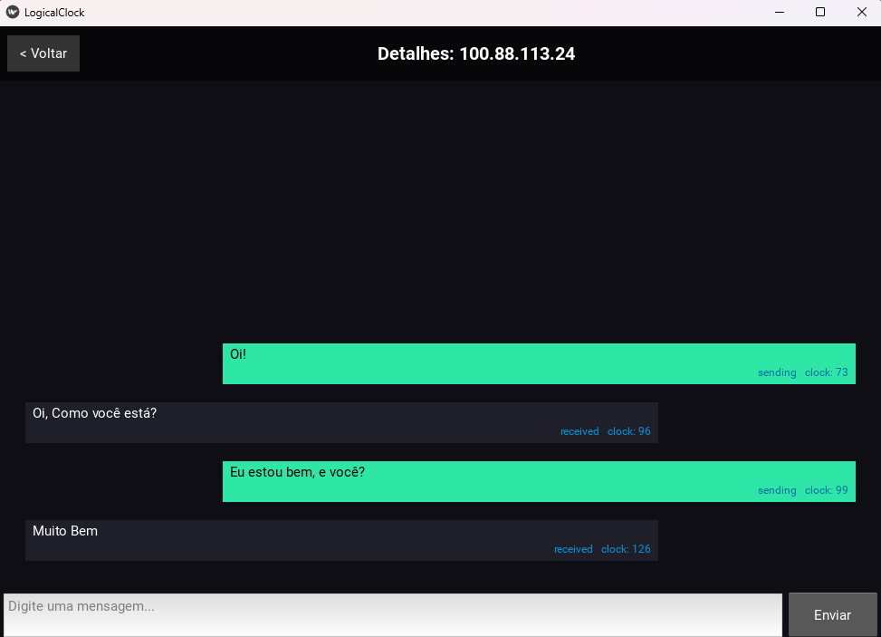
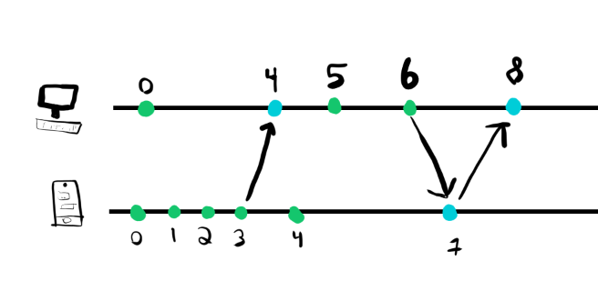
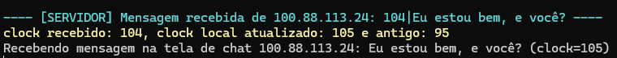

# Lamport Chat

Autor: **Marcos Henrique Almeida Lima**



---


## 1. Introdução

O projeto **Lamport Chat** é um aplicativo cliente-servidor desenvolvido para demonstrar, de forma prática, o conceito de **Relógios Lógicos de Lamport**, amplamente utilizado em sistemas distribuídos para estabelecer uma ordem parcial entre eventos.

A aplicação simula um ambiente distribuído no qual diferentes processos trocam mensagens e, a cada recebimento, atualizam seus relógios lógicos.

O objetivo principal é mostrar como a sincronização de eventos pode ser alcançada **sem depender de relógios físicos**, apenas com contadores lógicos atualizados de forma consistente.

Com esse objetivo, o hórario que deveria aparecer em cada mensagem foi substituido pelo valor do relógio lógico, permitindo observar como os eventos são ordenados em um sistema distribuído.

---


## 2. Título e tema escolhido

**Tema:** Comunicação distribuída com uso de Relógios Lógicos de Lamport  
**Conceito abordado:** Ordenação de eventos, comunicação entre processos e consistência parcial em sistemas distribuídos.

---

## 3. Objetivos do trabalho

O trabalho tem como objetivos principais:

- Implementar uma aplicação simples que simula a troca de mensagens entre processos.
- Demonstrar o funcionamento dos Relógios Lógicos de Lamport durante operações de envio e recebimento de mensagens.
- Mostrar como eventos distribuídos podem ser ordenados sem o uso de relógios físicos sincronizados.
- Fornecer um ambiente visual para observar a evolução do relógio lógico em cada operação.
- Explorar comportamentos típicos de sistemas distribuídos, como atrasos, concorrência e ordem de mensagens.

---

## 4. Fundamentação teórica

Sistemas distribuídos enfrentam desafios como ausência de relógio global, atrasos de rede e concorrência entre processos.  
Para lidar com isso, Leslie Lamport propôs em 1978 o conceito de **relógios lógicos**, que permitem estabelecer uma ordenação parcial entre eventos distribuídos.



Funciona da seguinte forma:
- Cada processo mantém um contador inteiro (relógio lógico).
- O contador é incrementado antes de cada evento interno e antes do envio de mensagens. 
- Ao receber uma mensagem, o processo atualiza seu relógio lógico para o máximo entre seu valor atual e o valor recebido, incrementando-o em seguida.

 
---

### 4.1. Relógios Lógicos de Lamport

Um relógio lógico é um contador inteiro, incrementado em três situações:

1. Antes de cada evento interno do processo.  
2. Antes de cada envio de mensagem.  
3. Ao receber uma mensagem:


## 5. Tecnologias utilizadas

- **Linguagem de Programação:** Python  
- **Framework de Interface Gráfica:** Kivy
- **Banco de Dados:** TinyDB  
- **Bibliotecas de Rede:** socket, threading


## 6. Instruções para execução

### Pré-requisitos
- Python 3.x instalado no sistema.
- Instalar as dependências necessárias:
```bash
pip install kivy tinydb socket
```
- executar o arquivo 'main.py' em pelo menos duas instâncias diferentes (pode ser em máquinas diferentes ou na mesma máquina com portas diferentes).
- Configurar os endereços IP e portas de envio/recebimento conforme necessário.

## 7. Projeto no GitHub

O código-fonte completo do projeto está disponível no GitHub:  
[https://github.com/Glitcht0/Distribuidos]